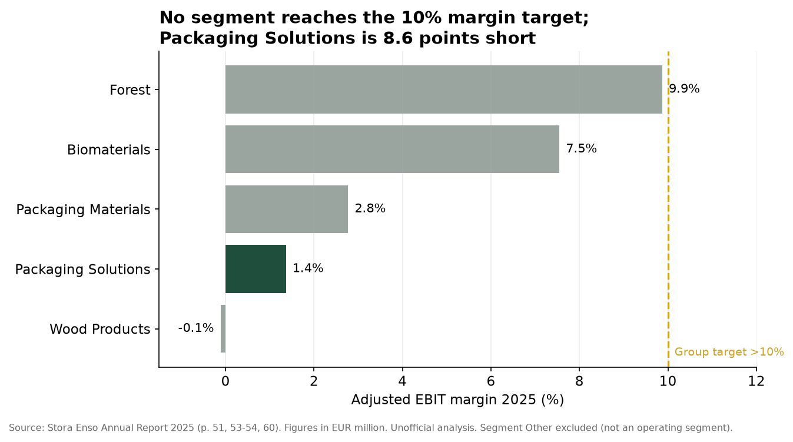
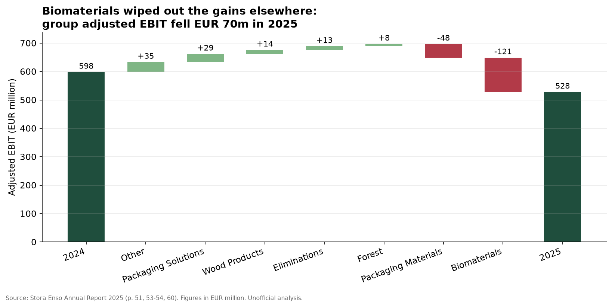
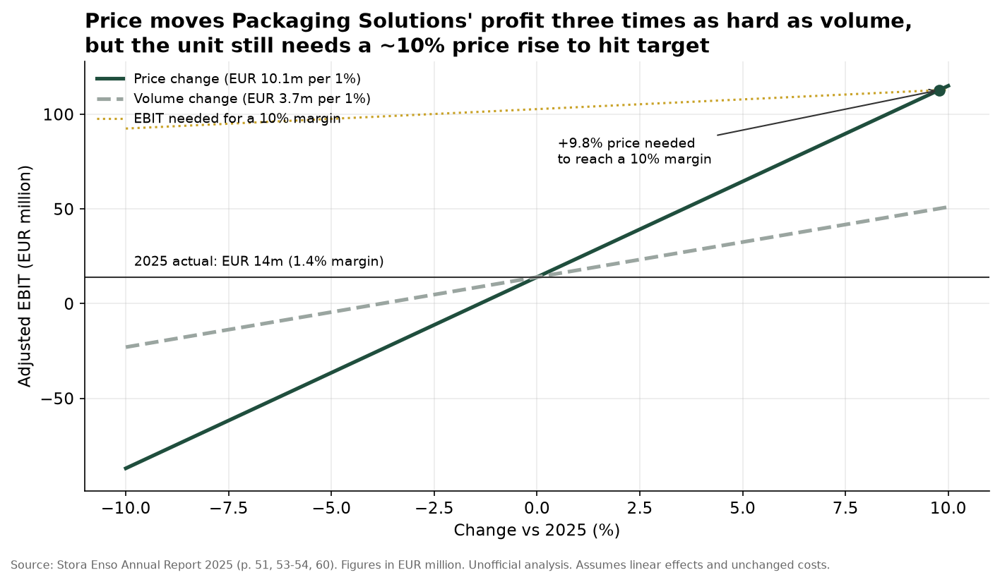

# What the data shows

Analysis of the Stora Enso Annual Report 2025, built from the validated output
of `extract_annual_report.py` and charted by `make_charts.py`.

## Why this matters

From 2026 Stora Enso is working to new financial targets: an adjusted EBIT
margin above 10%, revenue growth above 4%, and net debt below 1x adjusted
EBITDA (Annual Report 2025, p. 64). In 2025 the group delivered a 5.7% margin
and 2.8x leverage. Closing that gap is the central management task, and it is
what performance analysis inside the business areas exists to support.

## 1. Where the margin gap sits

**Context.** Stora Enso runs seven P&L-responsible business areas, introduced in
July 2025 to sharpen accountability. Each now has to justify its returns
separately.

**What it shows.** No segment reached the 10% target in 2025. Forest came
closest at 9.9%, followed by Biomaterials at 7.5%. Packaging Solutions, a
converting business making corrugated packaging, earned 1.4%, and its return on
operating capital was 2.4% (p. 53).

**Why it matters.** The best-performing segment is Forest, which is asset-rich
rather than operational. Among the industrial businesses, margins run between
-0.1% and 7.5%, so the packaging side carries most of the improvement burden.
For Packaging Solutions the gap is roughly EUR 89m of EBIT on 2025 sales.

## 2. What moved group profit in 2025

**Context.** Group adjusted EBIT fell from EUR 598m to EUR 528m. The headline
decline hides movement in opposite directions across the segments.

**What it shows.** Packaging Solutions improved by EUR 29m, turning an EBIT loss
of EUR 15m into a EUR 14m profit through value-based selling. Wood Products
(+EUR 14m), Forest (+EUR 8m) and Segment Other (+EUR 35m) also improved. Those
gains were more than offset by Biomaterials (-EUR 121m), hit by lower pulp
prices, and Packaging Materials (-EUR 48m), affected by the Oulu ramp-up.

**Why it matters.** This is the difference between a headline number and an
explanation. Four of six segments improved; the group still went backwards. A
controller's job is to separate what the business influenced from what the
market did, because the two call for different responses.

## 3. What would actually close the gap

**Context.** The report publishes the operating profit impact of a ±10% change
in price or volume for each segment (p. 60, Table 1). For Packaging Solutions
these are EUR 101m and EUR 37m.

**What it shows.** Price moves profit about three times as hard as volume:
roughly EUR 10.1m per percentage point against EUR 3.7m. Holding costs and
volume flat, the unit would need a price rise of about 9.8% to reach a 10%
margin.

**Why it matters.** A 10% price rise is not realistic in a market the company
itself describes as oversupplied: European corrugated demand grew 2% in 2025
while Packaging Solutions' volumes rose 1%. So the gap cannot be priced away.
With materials and services at roughly 67% of the segment's sales and personnel
at 18% (p. 143), the remaining levers are cost, product and customer mix, and
plant-level efficiency — all of which need analysis at a finer grain than the
segment reporting provides.

## Summary of findings

1. **The gap is concentrated in converting, not in fibre.** Forest and
   Biomaterials earn reasonable returns; the packaging businesses do not.
2. **2025 was a mixed year, not a bad one.** Four segments improved. Pulp prices
   and the Oulu ramp-up drove the decline, and both are largely outside the
   business areas' control.
3. **Price is the strongest lever but not a sufficient one.** The required
   increase is close to 10%, against a market with overcapacity.
4. **That points the analytical work at cost, mix and plant performance**, which
   is where the reporting has to get more granular than the published segments.
5. **The reporting structure itself is changing.** From Q1 2026, Packaging
   Solutions is reported inside a new Integrated Packaging segment alongside
   Containerboard (p. 64), so comparatives will need mapping between the old and
   new structures.

## Method and limitations

Figures are extracted programmatically from the PDF and reconciled to the
published group totals before use. The sensitivity analysis assumes linear
effects and unchanged costs, which is a simplification: in practice a price
rise would face volume loss, and cost inflation moves independently.

*All figures from the Stora Enso Annual Report 2025. Independent analysis of
public data; not affiliated with Stora Enso.*
